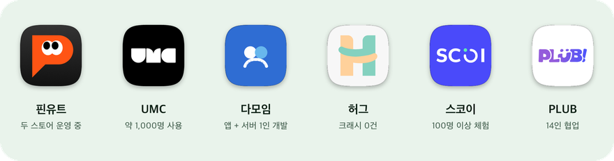
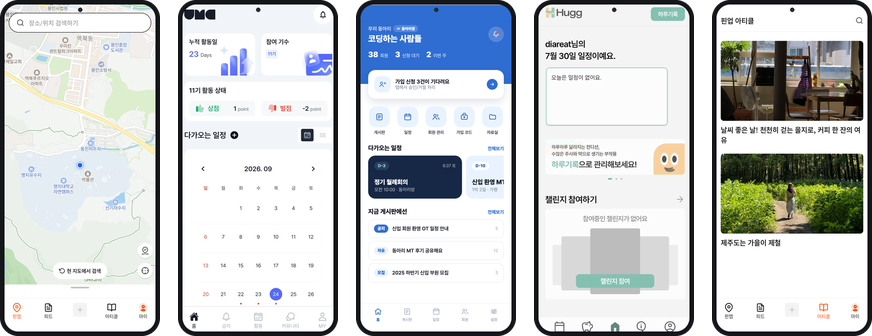
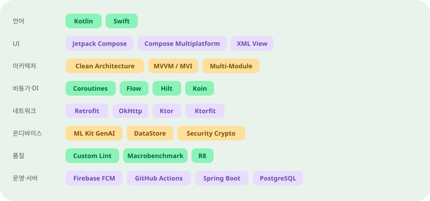
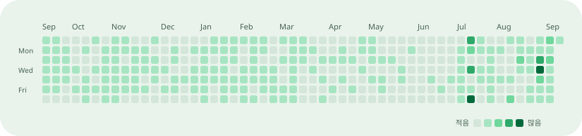
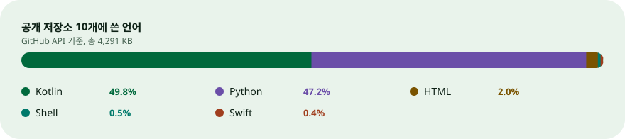

  

앱을 만들고, 출시하고, 운영합니다. Kotlin 하나로 Android와 iOS, 서버까지 다룹니다.
가끔은 바탕화면에 포켓몬을 풀어놓기도 합니다.

  

만든 것과 공부한 것을 모두 [포트폴리오](https://gyeongseok.vercel.app)에 정리해 두었습니다.

## 만든 앱

  <picture>
    <source media="(prefers-color-scheme: dark)" srcset="assets/apps-dark.png">
    
  </picture>

  <picture>
    <source media="(max-width: 560px)" srcset="assets/screens-narrow.png">
    
  </picture>

- **핀유트** (구 핀업) — Compose Multiplatform 단일 코드베이스로 Android와 iOS에 동시 출시한 지도 기반 장소 공유 SNS.
  [저장소](https://github.com/TEAM-PIN-UP/MOBILE-PIN-UP), [Play Store](https://play.google.com/store/apps/details?id=com.pinup.placePinup), [자세히](https://gyeongseok.vercel.app/projects/pinyut)
- **UMC 운영 앱** — 전국 28개 대학 약 1,000명이 쓰는 동아리 운영 앱. 중앙 안드로이드 파트장을 겸하고 있습니다.
  [저장소](https://github.com/UMC-PRODUCT/umc-product-android), [Play Store](https://play.google.com/store/apps/details?id=com.umc.product), [자세히](https://gyeongseok.vercel.app/projects/umc)
- **다모임** — 기획과 디자인부터 앱, 서버, 배포까지 혼자 만드는 동아리 운영 앱.
  [클라이언트](https://github.com/rudtjr1106/damoim), [서버](https://github.com/rudtjr1106/damoim-server), [자세히](https://gyeongseok.vercel.app/projects/damoim)
- **허그** — 난임 환자와 가족을 위한 케어 앱. 약 100명이 쓰는 동안 크래시 0건.
  [저장소](https://github.com/FOREGG-DEV/FOREGG_Android), [자세히](https://gyeongseok.vercel.app/projects/hugg)
- **스코이** — 스테이블코인 결제를 계좌이체처럼 쉽게 만드는 결제·송금 앱. 구조 설계와 충전 파트를 맡았습니다.
  [저장소](https://github.com/UMCSCOI/Android), [서비스 소개](https://fulfilled-moment-057123-029c9b424.framer.app), [자세히](https://gyeongseok.vercel.app/projects/scoi)
- **PLUB** — 14명이 함께한 첫 협업 프로젝트.
  [저장소](https://github.com/PLUB2022/PLUB-Android), [자세히](https://gyeongseok.vercel.app/projects/plub)

## 그 외

  

- **포스크탑** — 일하는 화면 한켠에서 포켓몬이 걸어다닙니다. 풀숲이 돋아나고, 야생 포켓몬이 나타나고, 잡아서 키웁니다. Windows와 macOS 둘 다.
  지금 138명이 쓰고 있고, 소개 릴스는 조회수 약 2만 회를 넘겼습니다.
  [저장소](https://github.com/rudtjr1106/poketdesktop), [받기](https://github.com/rudtjr1106/poketdesktop/releases/latest), [자세히](https://gyeongseok.vercel.app/projects/poketdesktop)
- **스위치보드** — Android 원격 설정을 폼으로 고치면 PR부터 검증, 배포까지 대신 해 주는 macOS·Windows 앱. 안내 문구 초안은 기기 안의 LLM이 씁니다.
  [저장소](https://github.com/rudtjr1106/switchboard), [자세히](https://gyeongseok.vercel.app/projects/switchboard)
- **LanDrop** — 같은 공유기에 있는 내 기기끼리, 서버 없이 파일을 주고받습니다.
  [저장소](https://github.com/rudtjr1106/LanDrop), [자세히](https://gyeongseok.vercel.app/projects/landrop)

> 걷는 도트는 포스크탑이 쓰는 것과 같은 [SpriteCollab](https://github.com/PMDCollab/SpriteCollab) 스프라이트입니다(CC BY-NC 4.0). 포켓몬은 닌텐도 / Game Freak / 포켓몬 컴퍼니의 저작물이고, 포스크탑은 팬이 만든 비상업 프로젝트입니다. [전체 출처](https://github.com/rudtjr1106/poketdesktop/blob/main/CREDITS.md)

## 주로 쓰는 것

  <picture>
    <source media="(prefers-color-scheme: dark)" srcset="assets/stack-dark.svg">
    
  </picture>

## 기록

  <picture>
    <source media="(prefers-color-scheme: dark)" srcset="assets/contrib-dark.svg">
    
  </picture>

  <picture>
    <source media="(prefers-color-scheme: dark)" srcset="assets/langs-dark.svg">
    
  </picture>

  <picture>
    <source media="(prefers-color-scheme: dark)" srcset="https://streak-stats.demolab.com/?user=rudtjr1106&background=0F2318&stroke=38513F&ring=5CDD95&fire=D2BBFF&currStreakNum=DCE9DF&currStreakLabel=A6C3AE&sideNums=DCE9DF&sideLabels=A6C3AE&dates=A6C3AE&hide_border=true&border_radius=28&locale=ko">
    
  </picture>

## 연락

[포트폴리오](https://gyeongseok.vercel.app), [rudtjr1206@gmail.com](mailto:rudtjr1206@gmail.com), [기술 블로그](https://velog.io/@rudtjr1106)
